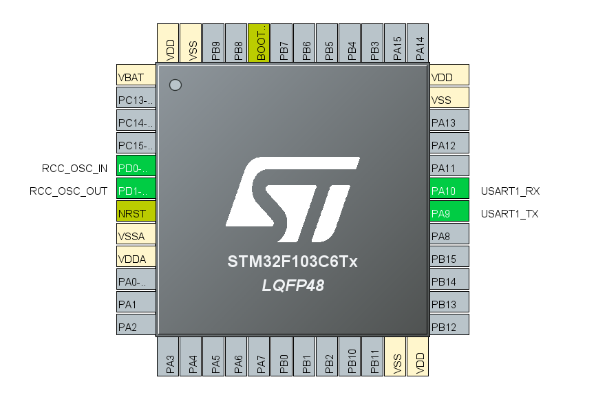
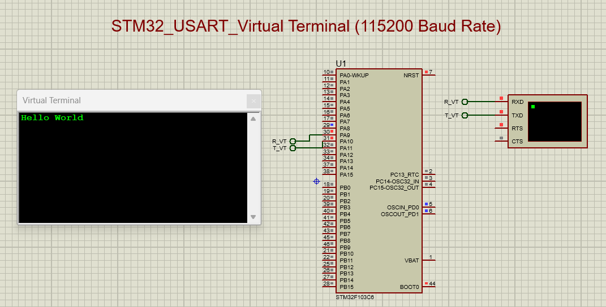

# STM32 UART Hello World

## Definition
Print **"Hello World"** only once at **115200 baud rate** in the terminal (Virtual Terminal in Proteus 8).

---

## Software Used
- STM32CubeMX  
- STM32CubeIDE  
- Proteus 8  

---

## Pin Description



| Pin Name | Function    | Description                        |
|----------|-------------|------------------------------------|
| PA9      | USART1_TX   | Transmits data to Virtual Terminal |
| PA10     | USART1_RX   | Receives data (not used here)      |
| GND      | Ground      | Common ground connection           |
| VCC      | 3.3V        | Power supply to STM32              |
| PD0      | RCC_OSC_IN  | Ceremic Crystal Oscillator In      |
| PD1      | RCC_OSC_OUT | Ceremic Crystal Oscillator Out     |

---

## Code

```c
int main(void)
{
  // Initialize HAL and reset peripherals
  HAL_Init();

  // Configure system clock
  SystemClock_Config();

  // Initialize peripherals
  MX_GPIO_Init();
  MX_USART1_UART_Init();

  // Transmit message once
  uint8_t msg[] = "Hello World";
  HAL_UART_Transmit(&huart1, msg, sizeof(msg) - 1, HAL_MAX_DELAY);

  // Infinite loop
  while (1)
  {
  }
}
```

## Outcome

